<h3 align="center"><code>01 / ABOUT</code></h3>

<h3 align="center"><code>02 / TECH ECOSYSTEM</code></h3>

<table align="center">
<tr>
<td align="center" width="50%">
<b><code>FRONTEND</code></b>  
 
HTML · CSS · JavaScript · Bootstrap
</td>
<td align="center" width="50%">
<b><code>BACKEND</code></b>  
 
PHP · .NET / ASP.NET
</td>
</tr>
<tr>
<td align="center" width="50%">
<b><code>DATABASE</code></b>  
 
MySQL
</td>
<td align="center" width="50%">
<b><code>TOOLS / WORKFLOW</code></b>  
 
Git · GitHub · VS Code · WordPress
</td>
</tr>
</table>

<h3 align="center"><code>03 / FEATURED PROJECTS</code></h3>

 
<a href="https://byteforge-affan-portfolio.netlify.app/"><b>Live site ↗</b></a> &nbsp;·&nbsp; <a href="https://github.com/byteforge-affan/byteforge-portfolio">Repository →</a>

 
<a href="https://zandsenterprises.com/"><b>Live site ↗</b></a> &nbsp;·&nbsp; <a href="https://github.com/byteforge-affan/ZandS_Enterprises">Repository →</a>

 
<a href="https://github.com/byteforge-affan/Jobix"><b>Repository →</b></a>

 
<a href="https://paarees-luxury-scents.netlify.app/"><b>Live site ↗</b></a> &nbsp;·&nbsp; <a href="https://github.com/byteforge-affan/E-PROJECT-PAAREES-PERFUME-">Repository →</a>

<a href="https://github.com/byteforge-affan?tab=repositories"><code>EXPLORE ALL REPOSITORIES →</code></a>

<h3 align="center"><code>04 / DEVELOPMENT JOURNEY</code></h3>

